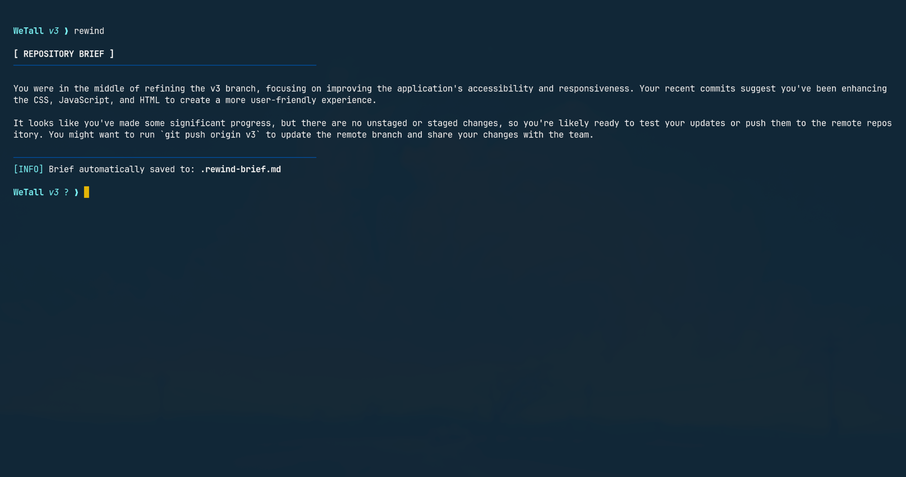
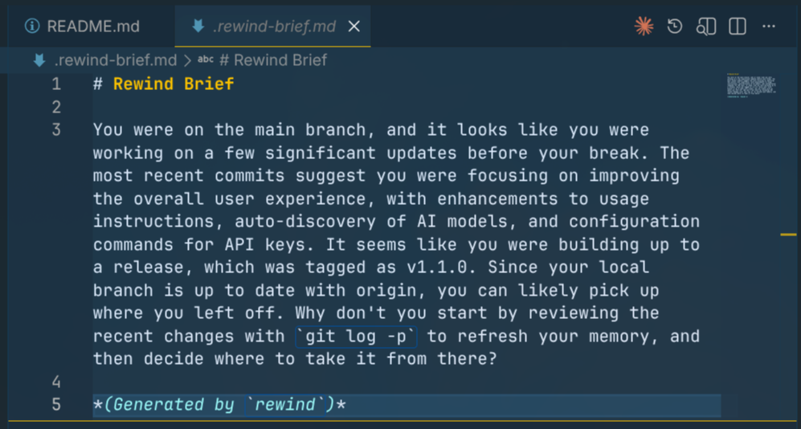

# Rewind

An AI-powered CLI tool that instantly tells you where you left off in your Git repository. 

Run it, get briefed. No manual notes, no journals, fully automatic.

## The Problem
You work on a feature, switch to a bugfix, leave for the weekend, and come back on Monday with no idea what you were doing. You start running `git status`, `git log`, `git diff` trying to reconstruct your train of thought.

## The Solution
`rewind` analyzes your repository state (branch, recent commits, staged and unstaged changes) and feeds it to an LLM to give you a personalized, conversational briefing on what you were working on and what you left unfinished.

## Demo & Screenshots

**Video Demo:**
<video src="./Assets/demo.mp4" controls muted></video>

**Rewind in Action:**


**Commit Mode:**


## Installation

### Option 1: Automatic Install Scripts (Recommended)
You do not need Rust or developer tools installed. These scripts will download the latest binary, place it in an appropriate folder (`~/.local/bin` for Unix, `%USERPROFILE%\.rewindin` for Windows), and automatically add it to your system's PATH.

**Windows (PowerShell):**
```powershell
Invoke-WebRequest -Uri "https://raw.githubusercontent.com/Chronos778/git-rewind/main/install.ps1" -OutFile "$env:TEMP
ewind_install.ps1"
powershell -ExecutionPolicy Bypass -File "$env:TEMP
ewind_install.ps1"
```
*(If Windows Defender says it's "not safe to run" after installation, it's just because the binary is unsigned. Click "More info" -> "Run anyway", or use Option 2 below if you prefer to compile it yourself.)*

**Linux / macOS (Bash):**
```bash
curl -fsSL https://raw.githubusercontent.com/Chronos778/git-rewind/main/install.sh | bash
```

### Option 2: Using Cargo (crates.io)
If you already have the Rust toolchain installed, you can compile and install it directly from crates.io. This bypasses the unsigned binary warning on Windows entirely since it compiles locally!
```bash
cargo install git-rewind
```

### Option 3: Manual Pre-compiled Binaries
1. Go to the [Releases](https://github.com/Chronos778/git-rewind/releases) page of this repository.
2. Download the archive for your operating system (`.zip` for Windows, `.tar.gz` for macOS/Linux).
3. Extract the `rewind` executable and add it to your PATH manually.

## Configuration & Commands

By default, the first time you run `rewind`, it will launch an interactive setup prompting you to paste an API key. 
You can use the new `config` command to manually add, view, or remove multiple API keys:

```bash
# View your saved keys (redacted) and current models
rewind config show

# Add or change a specific provider's key
rewind config set groq gsk_123456789...
rewind config set gemini AIzaSyB...
rewind config set openai sk-proj-...

# Set a custom model for a provider
# (Useful if the default model is decommissioned or you want to use a newer one)
rewind config model groq llama-3.3-70b-versatile
rewind config model openai gpt-4o

# Delete a key and model settings
rewind config clear openai
```

Alternatively, `rewind` checks your environment variables for keys to several top providers:

To use **Groq** (insanely fast, generous free tier):
```bash
# Linux/macOS:
export GROQ_API_KEY="gsk_..."

# Windows PowerShell:
$env:GROQ_API_KEY="gsk_..."
```

To use **Gemini** (huge free tier, context window):
```bash
# Linux/macOS:
export GEMINI_API_KEY="AIza..."

# Windows PowerShell:
$env:GEMINI_API_KEY="AIza..."
```

To use **OpenAI**:
```bash
# Linux/macOS:
export OPENAI_API_KEY="sk-..."

# Windows PowerShell:
$env:OPENAI_API_KEY="sk-..."
```

*(Note: If multiple keys are set, it prioritizes Groq > Gemini > OpenAI to help limit accidental costs).*

### Custom Models / Local LLMs (Ollama, vLLM)
You can override the API base and model used by setting these variables (works perfectly with local servers like Ollama!):
```bash
# Linux/macOS:
export OPENAI_API_BASE="http://localhost:11434/v1"
export OPENAI_MODEL="llama3-8b-8192"
export OPENAI_API_KEY="ignore" # If using a local tool that ignores keys

# Windows PowerShell:
$env:OPENAI_API_BASE="http://localhost:11434/v1"
$env:OPENAI_MODEL="llama3-8b-8192"
$env:OPENAI_API_KEY="ignore"
```

## Usage

Simply navigate to any Git repository and run:
```bash
rewind
```

When you run `rewind`, it performs the following automatically:
1. Analyzes your Git state (branch, recent commits, staged and unstaged changes).
2. Sends the context to the configured LLM.
3. Prints a conversational brief about your repository.
4. Saves a copy of the brief to `.rewind-brief.md` in your current directory and adds it to your `.gitignore`.

### Advanced Commands

`rewind` comes with several additional productivity tools built-in:

**Generate a Commit Message**  
Automatically write a conventional commit message based on your staged/unstaged changes:
```bash
rewind commit
```

**Ask Codebase Questions**  
Ask the AI a specific question about your uncommitted changes or recent work:
```bash
rewind ask "Did I finish implementing the user authentication?"
```

**Token Estimation**  
Check how many tokens/characters your changes will consume before making an API call:
```bash
rewind estimate
```

**Output Formatting**  
You can modify how `rewind` outputs data using flags:
```bash
# Output exactly 2 sentences maximum
rewind --short

# Output raw JSON for scripts to consume
rewind --json

# See exactly what raw Git data is being sent to the AI (skips API call)
rewind --dry-run
```

### Excluding Files (`.rewindignore`)
If you have massive auto-generated files (like `package-lock.json` or compiled assets) that your `.gitignore` might miss but you want to hide from the AI to save tokens, create a `.rewindignore` file in your repository:
```text
# Example .rewindignore
yarn.lock
Cargo.lock
dist/
*.svg
```

### Maintenance Commands

```bash
# Update rewind to the latest version directly from GitHub Releases
rewind update

# Uninstall rewind and remove all stored configuration/keys
rewind uninstall
```
